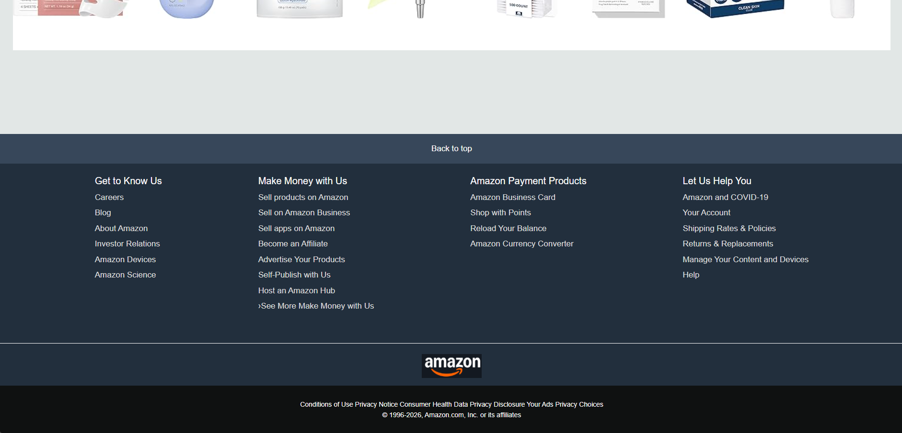

# 🛒 Online Shopping Website

An e-commerce web application that allows users to browse products, add items to the cart, and simulate an online shopping experience through a clean and user-friendly interface.

---

## 🚀 Features

- 🛍️ Product Listing & Browsing  
- 🔍 Search Functionality  
- 🛒 Add to Cart System  
- 🧾 Cart Management  
- 👤 User-Friendly Interface  
- 📱 Responsive Design  

---

## 🛠 Tech Stack

- **Frontend:** HTML, CSS, JavaScript  
- **Backend:** PHP  
- **Database:** MySQL  

---

## 📸 Screenshots

  
  
  

---

## ⚙️ How to Run Locally

1. Install XAMPP  
2. Start **Apache** and **MySQL**

---

## 💡 Future Improvements

- 💳 Payment Gateway Integration  
- 🔐 User Authentication System  
- 📦 Order Tracking  
- ❤️ Wishlist Feature  

---

## 👨‍💻 Author

**Mayank Kumar**  
📧 mayankbarnwal72@gmail.com  
🔗 LinkedIn: https://www.linkedin.com/in/mayank-kumar-5b3171290/  
💻 GitHub: https://github.com/Mayank934j  

---

## ⭐ Support

If you like this project, give it a ⭐ on GitHub!
4. Copy project folder to `htdocs`  
5. Import database in **phpMyAdmin**  
6. Open browser and go to:
